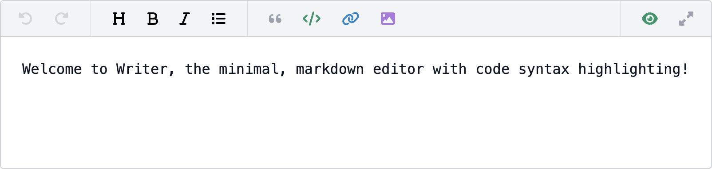

<!-- Screenshot -->
<p align="center">
    
</p>

<!-- Badges -->
<p align="center">
    
    
</p>

<!-- Update badges -->

# Writer

This package contains a minimal, Markdown editor with preview support as well as code syntax highlighting. It was extracted and refined from an original implementation used by [Lumeno](https://lumeno.dev). It is currently a work-in-progress and is under development.

## Installation

Since Writer is currently pre-release, you will need to clone the repository or download a zip of it. Once you have the files, refer to `index.html` for an example of how it can be used.

## Promo

[Lumeno](https://lumeno.dev) allows you to centralize your IT résumé, project portfolio and blog content. It aids in building a following, helps you to discover other creatives, and gets you invited to relevant jobs that match your personal requirements, such as minimum salary, availability, location, commute distance, and much more... [sign up for free!](https://lumeno.dev)

<!-- Screenshot -->
<p align="center">
    <a target="_blank" href="https://lumeno.dev">
        
    </a>
</p>

## Usage

To set the content that should be rendered / made editable, simply assign it using `v-model`. This will ensure proper two-way data binding and eliminate the need to listen for a 'change' or 'input' event.

```js
data() {
    return {
        content : 'Welcome to Writer, the minimal, markdown editor',
    }
},

<Writer v-model="content"></Writer>
```

Writer is designed to require minimal, even zero-configuration. However, should you use wish to customize it, then you can do so using the following `props`:

| Name         | Type    | Summary                                                                      |
| ------------ | ------- | ---------------------------------------------------------------------------- |
| darkMode     | Boolean | Toggle whether the editor uses dark mode CSS styling (default is false)      |
| height       | Number  | Set the minimum height in pixels (default is 300, less may create UI quirks) |
| maxUndo      | Number  | Set the maximum number of undo / redo operations (default is 20)             |
| progress     | Number  | Set the percentage (0 - 100) on the image uploading progress bar             |
| placeholder  | String  | Set the default placeholder text to display when the editor is empty         |
| uploads      | Boolean | Toggle whether the user can upload images or media (default is false)        |

### Localization

Writer allows you to customize the message prompts that are displayed when creating links or code blocks. If your intended audience speaks English, then there is no need to review this section. Otherwise, you can use the props below to alter the displayed text.

| Name         | Type   | Summary                                                                          |
| ------------ | ------ | -------------------------------------------------------------------------------- |
| displayText  | String | Set the text to show when asking for a link's label e.g. when inserting a link   |
| languageText | String | Set the text to show when asking for a code block's language                     |
| linkText     | String | Set the text to show when asking for a url e.g. when inserting a link            |

### Uploading media

Writer includes a mechanism to facilitate image / media uploading and insertion of the resulting link. To use this mechanism, first enable uploads and then add a listener for the `upload` event:

```js
<Writer :uploads="true"
        @upload="uploadImage($event)">
</Writer>
```

Next, within the `uploadImage` method (or whatever you provided), you should execute your own code to select a file and upload it to your server. If you are tracking the upload status and wish to present it to the user, then supply the value using the `progress` prop:

```js
<Writer :uploads="true"
        :progress="status"
        @upload="uploadImage($event)">
</Writer>
```
```js
let status = 0;

function uploadImage(hook)
{
    // Select a file...

    // Begin uploading...

    // Report on current status (54% complete)...
    status = 54;

    // ...
}
```

Writer will automatically display a progress bar beneath the toolbar if `progress` is set to anything other than zero.

When the file has been uploaded and you have a link to it, simply call `hook` and supply the url as a `string` parameter:

```js
function uploadImage(hook)
{
    // Upload complete
    hook('https://acme.com/files/image1.jpg');
}
```

Writer will insert the link into the editor, hide the progress bar, and re-enable the image toolbar button so that additional files can be uploaded.

#### Cancelling uploads

Since Writer doesn't actually have anything to do with the uploading process, you should cancel the upload yourself and then call `hook` without any parameters. Alternatively, supplying `undefined`, `null` or `''` as the parameter will achieve the same result.

### Styling

Writer includes a friendly set of styles that should be applicable to most applications. However, should you wish to create your own look, you can easily do so using the following self-explanatory CSS classes:

```css
.writer { }
.writer.fullscreen { }
.writer .toolbar { }
.writer .toolbar .toolbar-button { }
.writer .toolbar .toolbar-divider { }
.writer .toolbar .toolbar-left { }
.writer .toolbar .toolbar-left .toolbar-button-undo { }
.writer .toolbar .toolbar-left .toolbar-button-redo { }
.writer .toolbar .toolbar-left .toolbar-button-headings { }
.writer .toolbar .toolbar-left .toolbar-button-bold { }
.writer .toolbar .toolbar-left .toolbar-button-italic { }
.writer .toolbar .toolbar-left .toolbar-button-list { }
.writer .toolbar .toolbar-left .toolbar-button-blockquote { }
.writer .toolbar .toolbar-left .toolbar-button-code { }
.writer .toolbar .toolbar-left .toolbar-button-link { }
.writer .toolbar .toolbar-left .toolbar-button-upload-image { }
.writer .toolbar .toolbar-right { }
.writer .toolbar .toolbar-right .toolbar-button-edit { }
.writer .toolbar .toolbar-right .toolbar-button-preview { }
.writer .toolbar .toolbar-right .toolbar-button-fullscreen { }
.writer .toolbar .toolbar-right .toolbar-button-compact { }
.writer .content { }
.writer .content .editor { }
.writer .content .preview { }
.writer .content .progress { }
.writer .content .progress .position { }
```

If you wish to customize the styling that is used when the `darkMode` prop is set to `true`, then append the `.dark` class to the main `.writer` class e.g.

```css
.writer.dark .toolbar .toolbar-button { }
```

## Contributing

Thank you for considering a contribution to Writer. You are welcome to submit a PR containing improvements. Note that while the package is still under development, PRs do not require tests (although they are certainly welcome). Once an initial version is released, all future PRs will require tests to be accepted.

## License

The MIT License (MIT). Please see [License File](LICENSE.md) for more information.
