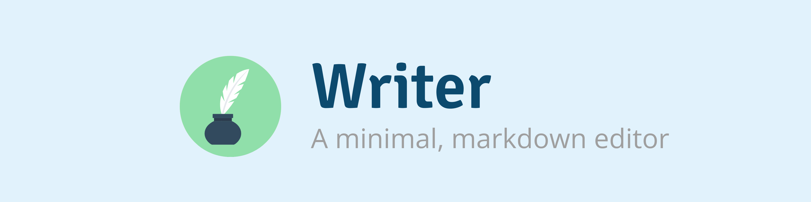

<!-- Header -->
<p align="center">
    
</p>

<!-- Badges -->
<p align="center">
    
    
</p>

<!-- Update badges -->

# Writer

This package contains a minimal, Markdown editor with preview support as well as code syntax highlighting. It was extracted and refined from an original implementation used by [Lumeno](https://lumeno.dev). It is currently a work-in-progress and is under development.

## Installation

Since Writer is currently pre-release, you will need to clone the repository or download a zip of it. Once you have the files, refer to `index.html` for an example of how it can be used.

## Promo

[Lumeno](https://lumeno.dev) allows you to centralize your IT résumé, project portfolio and blog content. It aids in building a following, helps you to discover other creatives, and gets you invited to relevant jobs that match your personal requirements, such as minimum salary, availability, location, commute distance, and much more... [sign up for free!](https://lumeno.dev)

<!-- Screenshot -->
<p align="center">
    <a target="_blank" href="https://lumeno.dev">
        
    </a>
</p>

## Usage

To set the content that should be rendered / made editable, simply assign it using `v-model`. This will ensure proper two-way data binding and eliminate the need to listen for a 'change' or 'input' event.

```js
data() {
    return {
        content : 'Welcome to Writer, the minimal, markdown editor',
    }
},

<Writer v-model="content"></Writer>
```

### Configuration

Writer is designed to require minimal, even zero-configuration. However, should you use wish to customize it, then you can do so using the following `props`:

| Name        | Type   | Summary                                                                 |
| ----------- | ------ | ----------------------------------------------------------------------- |
| height      | Number | Set the minimum height of the component in pixels (default is 200)      |
| placeholder | String | Set the default placeholder text to display when the component is empty |

### Styling

TBD.

## Contributing

Thank you for considering a contribution to Writer. You are welcome to submit a PR containing improvements. Note that while the package is still under development, PRs do not require tests (although they are certainly welcome). Once an initial version is released, all future PRs will require tests to be accepted.

## Credits

Quill icon by [Vectors Market](https://www.flaticon.com/free-icon/quill_234628).

## License

The MIT License (MIT). Please see [License File](LICENSE.md) for more information.
