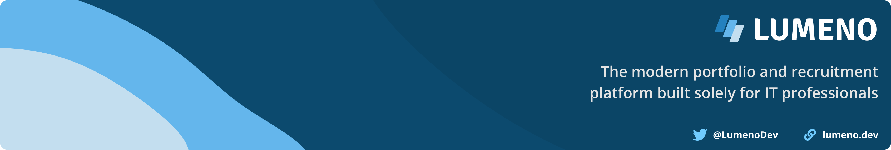

<!-- Header -->

    

<!-- Badges -->

    
    

# Update badges

# Writer

TBD.

## Installation

A UMD build is provided, but it is untested. In most cases, you should use the modern ES build.

## Promo

[Lumeno](https://lumeno.dev) allows you to centralize your IT résumé, project portfolio and blog content. It aids in building a following, helps you to discover other creatives, and gets you invited to relevant jobs that match your personal requirements, such as minimum salary, availability, location, commute distance, and much more... [sign up for free!](https://lumeno.dev)

<!-- Screenshot -->

    

## Credits

Quill icon by [Vectors Market](https://www.flaticon.com/free-icon/quill_234628).

## License

The MIT License (MIT). Please see [License File](LICENSE.md) for more information.
